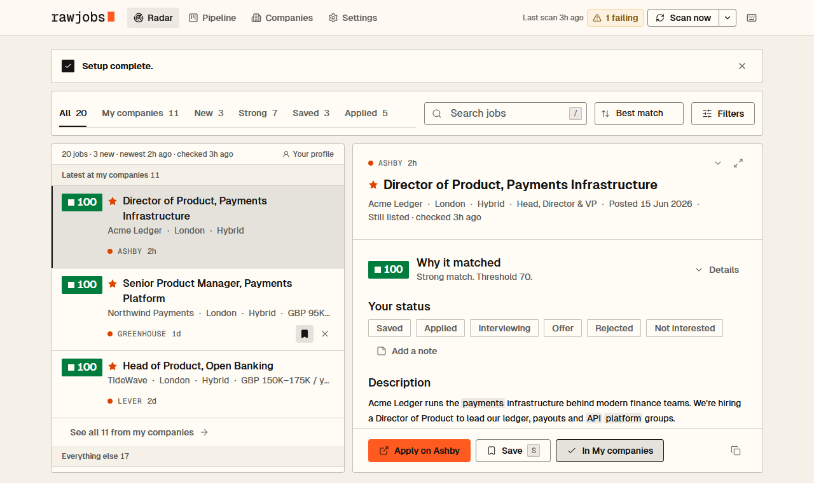

# RawJobs

**Jobs, straight from the source.**

[](https://github.com/Tanmay-Mhatre/rawjobs/actions/workflows/ci.yml) [](LICENSE) 

<picture>
  <source media="(prefers-color-scheme: dark)" srcset="docs/images/radar-dark.png">
  
</picture>

A free, self-hosted job radar. Tell it the roles, places and industries you want; RawJobs scans the careers pages of the companies that fit, from a directory of ~21,000 companies' hiring systems, scores every opening against your profile with clear keyword rules, and shows you the matches, with the companies you'd most like to join starred and their newest jobs up top.

Good roles often appear on company careers pages (Greenhouse, Lever, Ashby, Workday…) before LinkedIn, or never reach it. Checking 50 careers pages by hand doesn't happen. This does it for you.

> **Status: runs on your computer.** A web dashboard and a CLI with connectors for 23 hiring systems (Greenhouse, Lever, Ashby, Workday, SmartRecruiters and 18 more) and 4 public job boards, scoring, run history, scheduled scans and Telegram alerts. Scheduled scans in GitHub Actions are next. See [Roadmap](#roadmap).

Built by Tanmay Mhatre.

## Getting started

Requires Node 22+ and [pnpm](https://pnpm.io).

```bash
pnpm install
pnpm dev                # opens http://127.0.0.1:5173
```

The dashboard walks you through setup the first time (about 3 minutes; you can skip it and come back from any page):

1. **Resume**: paste your resume, or, if you keep several versions for different roles, copy the provided prompt into your own Claude or ChatGPT, attach them all, and paste the answer back. You get one master resume plus suggested roles, places and topics. It's saved to `profile/resume.md` (gitignored, never sent anywhere). Optional.
2. **Roles**: pick your job family; its titles appear as chips to select or deselect. Switching family resets titles and exclusions to that family's defaults (with Undo). Add titles from any of the 33 families with search.
3. **Locations**: search any country, city or region in the world. A country is one selection (its short names and main cities included); remove it in one click, or expand it to drop single cities. Choose whether remote roles count, and where.
4. **Industries**: pick the industries you'd like to work in (Crypto, Fintech, AI… 50 in all, in 7 groups). Companies in them are scanned and suggested. Optional.
5. **Review**: read it back in plain words, choose what counts as a strong match, and press **Save & find my jobs**.

Saving runs your first scan: your companies plus every company in the directory tagged with your industries, each fetched live. Then, optionally, pick the companies you'd love to work at in the **Companies** tab (search the directory, or paste a careers link): they're checked every scan, starred, and nudged up the list. Topics (keywords that rank a job higher) are prefilled from your resume and live in **Settings → Profile → Topics**.

Setup writes `rawjobs.config.local.yaml` (gitignored, commented, safe to edit by hand). After that, the Radar shows a checklist of anything still missing, explains a scan with no matches (and what to change), and flags companies whose links broke. Change anything later in **Settings**, or start over with **Settings → Your data → Start setup over**.

Prefer the terminal? Copy `rawjobs.config.example.yaml` to `rawjobs.config.local.yaml`, edit it, then `pnpm rawjobs validate` and `pnpm rawjobs scan`.

## Dashboard

- **Radar**: every job for you in one list, best match first: fit, then freshness (the boost halves every 3 days), with **your companies starred (★)**, nudged up by 10 and their three newest jobs in a strip on top. Newest, salary and company sorts mean exactly that. One company shows two roles before the rest fold into "+N more". Views: All, My companies, New, Strong, Saved, Applied, plus views you save yourself. Sort by best match, newest, highest salary or company. Filter by date posted, country, location, workplace, seniority, industry, company, keywords, match and hiring system; search.
- **Job detail**: score breakdown (why it matched), description, salary, notes, status, copy the description for CV tailoring.
- **Pipeline**: saved → applied → interviewing → offer → rejected. Drag cards between columns (or use the keyboard; on phones, one column at a time).
- **Companies**: My companies, with what each has for you now, scan health and broken links; companies with nothing for you in 10+ scans over a week are flagged for removal. **Suggestions** and **Browse all** search the directory; **Add by link** takes any careers page. Hidden companies, with Show again.
- **Settings**:
  - **Profile**: master resume, roles, locations, industries, topics.
  - **Scans & alerts**: strong-match threshold, scheduled scans, Telegram alerts, what a scan covers by default.
  - **Your data**: export / import your tracking data, sharing, start setup over.
  - **Appearance**: light, dark or system theme, an increased-contrast option, and job list density.

Statuses and notes live in your browser (export them for backup). **Scan now** in the header scans on your machine and shows its progress there (hover it for details); with Telegram set up, you get a message when it's done.

Keyboard: `j`/`k` move, `Enter` open, `s` save, `a` applied, `x` not interested, `c` copy description, `/` search, `1`–`4` sections, `?` help, `Esc` close.

## Scans

A scan has one of two scopes:

| Scope | Covers | Time |
| --- | --- | --- |
| **My companies + my industries** (`mine`, default) | your companies, plus every live directory company tagged with your industries | a minute or two |
| **All companies** (`all`) | your companies, plus every live board in the directory | longer; can be stopped and resumed |

Every scan:

1. **Syncs the directory**: a small manifest check, and a download only when there's a newer version.
2. **Uses the shared daily job feed** to skip directory companies that have nothing passing your title and location gates. Your own companies, companies the feed doesn't cover, and feed data older than 3 days are always fetched live.
3. **Fetches live** from each remaining company's hiring system, scores every job, and merges the result into `data/`. Every job you see was fetched by your own scan.

Jobs keep their first-seen date, and a job missing from two successful scans of its company is marked closed. A company whose feed fails never closes its jobs.

### Scheduled scans and alerts

- **Scheduled scans** (Settings → Scans & alerts): pick one or two times a day and a scope. RawJobs registers the scan with your computer's own scheduler (Windows Task Scheduler, macOS launchd, or a systemd user timer on Linux). It runs while the computer is on and catches up on a missed run. From the terminal: `pnpm rawjobs schedule install --time 08:00 --scope mine`.
  - Linux without systemd: add a cron line instead, for example `0 8 * * * cd /path/to/rawjobs && pnpm rawjobs scan --notify`.
- **Telegram alerts**: a 2-minute guided setup with your own bot (make a bot with @BotFather, press Start, done), then a test message. Each scheduled scan sends one digest of new matches, and nothing when nothing is new. The bot token and chat ID are kept in `profile/secrets.json` (gitignored), or read from `TELEGRAM_BOT_TOKEN` and `TELEGRAM_CHAT_ID`.

## Command line

`pnpm rawjobs scan` (alias `run`) prints every job that passes your title and location gates, best first, with the reason for its score:

```
★  74  Head of Product, Exchange
        Acme · Abu Dhabi; Dubai · hybrid · posted 2026-10-02
        title 30 · loc 20 · kw 14 (crypto, tokenization, exchange) · fresh 10
        https://jobs.lever.co/acme/...
```

Useful flags:

| Flag | What it does |
| --- | --- |
| `--scope mine\|all` | What to scan (see [Scans](#scans)) |
| `--only <company>` | Test one of your companies |
| `--check <ats:slug>` | Check one directory company |
| `--full` | Fetch every company live, without the job feed |
| `--offline` | Skip the directory sync |
| `--fresh` | Start over instead of resuming a stopped scan |
| `--plan` | Show what each scope covers, without scanning |
| `--notify` | Send new matches to Telegram |
| `--all` | Also show gated-out jobs |
| `--dry-run` | Save nothing |
| `--json out/run.json` | Write the raw result |

Other commands:

```
rawjobs schedule <status|install|remove|run>     scans on a schedule on this computer
rawjobs alerts telegram <status|token|connect|test|on|off|forget>
rawjobs detect <url>...                          careers URLs → config lines
rawjobs validate                                 check your config file
rawjobs companies suggest                        directory companies that fit your profile
rawjobs directory <status|update|share>          the shared company directory
```

### Adding companies

Paste careers URLs into `detect` and copy the lines into `companies:`:

```bash
pnpm rawjobs detect https://jobs.lever.co/somecompany https://job-boards.greenhouse.io/other
```

| ATS | Careers URL looks like | Read from |
| --- | --- | --- |
| Greenhouse | `job-boards.greenhouse.io/{slug}` | public API |
| Lever | `jobs.lever.co/{slug}` (EU: `jobs.eu.lever.co`) | public API |
| Ashby | `jobs.ashbyhq.com/{slug}` | public API |
| SmartRecruiters | `careers.smartrecruiters.com/{slug}` | public API |
| Workday | `{tenant}.wd{N}.myworkdayjobs.com/{site}` | careers-site API (20 per page, capped at 2,000 jobs) |
| Workable | `apply.workable.com/{slug}` | widget feed |
| Recruitee | `{slug}.recruitee.com` | careers-site API |
| Personio | `{slug}.jobs.personio.com` (or `.de`) | XML feed |
| BambooHR | `{slug}.bamboohr.com/careers` | careers-page JSON |
| Breezy HR | `{slug}.breezy.hr` | careers-page JSON |
| Teamtailor | `{slug}.teamtailor.com/jobs` | RSS feed |
| Pinpoint | `{slug}.pinpointhq.com` | careers-site JSON |
| Rippling | `ats.rippling.com/{slug}/jobs` | board API |
| HiBob | `{slug}.careers.hibob.com` | careers-page API |
| Freshteam | `{slug}.freshteam.com/jobs` | widget feed |
| Comeet | `www.comeet.com/jobs/{company}/{uid}` | data embedded in the hosted page |
| Oracle Recruiting | `{pod}.fa.{dc}.oraclecloud.com/hcmUI/CandidateExperience/en/sites/{site}` | candidate-experience API |
| SAP SuccessFactors | `career{N}.successfactors.com/career?company={id}` (or `.eu`) | XML listing feed |
| Taleo | `{host}.taleo.net/careersection/{section}/jobsearch.ftl` | career-section search API |
| iCIMS | `careers-{slug}.icims.com/jobs` | portal search pages |
| Jobvite | `jobs.jobvite.com/{slug}` | careers search pages |
| JazzHR | `{slug}.applytojob.com/apply` | careers page |
| Zoho Recruit | `{slug}.zohorecruit.com/jobs/{page}` | data embedded in the careers page |

iCIMS, Jobvite and JazzHR have no keyless feed, so their connectors read the public careers pages. If a company changes its page template, that connector may need an update.

Public job boards (Hacker News "Who is hiring", Remotive, Arbeitnow, Remote OK) are added the same way, by pasting their link.

## The shared directory and job feed

Two things are built for everyone by GitHub Actions and published as releases of the directory repo. Neither knows anything about you.

- **The directory** (rebuilt weekly): which companies exist, which hiring system and board each one uses, whether it's live, and its industries. About 21,000 companies, ~14,000 with their open job titles and places indexed.
- **The job feed** (daily): every open job on the live Greenhouse, Lever, Ashby, SmartRecruiters and Workday boards, as a full copy plus a small change file per day. Scans use it only to skip companies with nothing for you.

How the directory is built (no AI, `scripts/catalog/`):

1. **Merge** public, permissively licensed lists of company job boards (CC BY 4.0, MIT, Apache-2.0), our own Common Crawl and Wayback Machine queries, Wikidata, and the **industry seed list**. Share-alike and non-commercial lists only cross-check, never add companies.
2. **Resolve** the seed list (`seeds/industries.json`, must-have companies per industry, editable): read each company's website the way a person would (homepage → careers link → the board it embeds) to find its hiring system. Polite: one request at a time per site, robots.txt honoured.
3. **Check** every board live with the cheapest call each hiring system offers (live / dormant / dead).
4. **Index** each live company's open job titles and locations (no descriptions).
5. **Tag** companies by industry from three sources: the source lists' own labels, the seed list, and their job titles (e.g. many "Forex" or "MT5" roles means a brokerage). Industries a company merely hires for (`title_tags`, e.g. "hires AI roles") are kept apart.
6. **Publish** to `data/catalog/`, and write **`out/coverage.md`**: per industry, how many must-have companies we can track, and which hiring systems to support next.

The dashboard downloads a newer directory by itself when yours is more than a week old (Settings → Scans & alerts). To rebuild it locally:

```bash
pnpm catalog:refresh
```

A company missing? Add it with **Add by link** (shared with the directory if sharing is on), or add it to `scripts/catalog/seeds/industries.json` in a pull request. Links people share are checked and added every few hours.

Source attribution: see `scripts/curate/sources/NOTICE.md` and the source list in `scripts/catalog/merge.ts`. Running your own directory: [docs/shared-directory.md](docs/shared-directory.md) and [docs/self-hosting.md](docs/self-hosting.md).

## How scoring works

No AI, fully explainable. Every job is scored 0–100:

1. **Gates.** The title must contain a `titles.include` term and no `titles.exclude` term. The location must match `locations.include`, or `locations.remote_ok` without also matching `locations.remote_exclude`, and the workplace (on-site, hybrid, remote) must be one you accept. Fail either and the job scores 0 and is hidden by default.
2. **Title, up to 30.** 20 for a title match, plus how close its level is to yours: +10 if it has a `seniority_boost` term or is at a level one of them names (Senior, Principal/Staff/Lead, Head/Director/VP), +5 one level away (a plain "Product Manager" when you're senior), nothing two or more levels away. With no seniority words, nothing is added.
3. **Location, up to 20.** 20 for an included place, 15 for an accepted remote region (or remote with no place named).
4. **Topics, up to 40.** The share of your keyword weight found in title + description: 40 × matched weight ÷ min(total weight, 12). Matching about three core topics fills the bar, so a short list isn't penalised. A topic in the title alone is worth up to 20.
5. **Industry, up to 10.** 10 if the company is in one of your `industries` (or is one of your companies, or you picked no industries), 5 if its industry isn't known, 0 if it's in another one. Your industries also add their topics (payments, trading…) at weight 2 when you haven't listed them yourself.

With no `keywords` at all, title + location + industry (out of 60) are scaled to 0–100.

The score says how well a job fits, not how old it is. The Radar's **Best match** order adds freshness when you look: score + 15 × 0.5^(age in days ÷ 3), +10 for your companies. So a strong job posted today beats an equal one from last week, and a weak new job never leaps a strong one.

Sandbox, training and test boards (e.g. "Lever Implementation Training Environment") are left out of the directory and never scanned.

Terms match whole words, case-insensitively: `ai` matches "AI-native" but not "maintain"; `product manager` matches "Product-Manager".

## Privacy

Your profile, resume, config, Telegram token and run history stay on your computer. The app has no telemetry. It talks to the companies' job boards (to scan), GitHub (to download the shared directory and job feed) and, if you set up alerts, Telegram.

**Sharing is on by default:** when you add a company by link that the directory doesn't have, its careers board (hiring system, board name, company name) is sent to the project's contribution inbox so everyone can find it. Nothing about you is sent. Turn it off in **Settings → Your data → Sharing** or with `directory.share_additions: false`. Full details: [PRIVACY.md](PRIVACY.md).

Your config lists the companies you're targeting. If you run RawJobs from GitHub, **create your copy as a private repository** (use "Use this template" → Private, not Fork; forks of public repos must stay public).

## Data & licenses

- **Code:** MIT ([LICENSE](LICENSE)), copyright Tanmay Mhatre. Use, change and share it freely; copies must keep the copyright and license notice.
- **Shared directory and job index:** CC BY 4.0. Sources and credits (Common Crawl, the Wayback Machine, Wikidata, permissively licensed board lists, user contributions) are in the directory repo's `NOTICE.md` ([template](services/directory-repo-template/NOTICE.md)).
- **Public job boards** (Hacker News "Who is hiring", Remotive, Arbeitnow, Remote OK) are fetched on your own computer only, at most a few times a day, credited by name with every job linking back to the board, and never shared or redistributed. (The Muse and Jobicy aren't included: their terms weren't confirmed.)
- **Remove a company:** open a [takedown request](.github/ISSUE_TEMPLATE/takedown.yml). We reply within 7 days, and removed companies go into `denylist.json`.
- **Running a fork with your own data:** [docs/self-hosting.md](docs/self-hosting.md).

## Fair use

RawJobs only reads public job postings that companies publish for their own careers pages. A scan makes one request per company it fetches, and the shared job feed lets it skip most companies with nothing for you. It spaces requests to the same host (about one a second), identifies itself with a User-Agent, slows down on rate limits, links to the original posting and never touches apply endpoints or candidate data. Keep it that way: prefer the default scope, keep your own list to the companies you really want (the Companies tab flags ones that never have anything for you), and don't scan more than a couple of times a day.

RawJobs is an independent project. It isn't affiliated with or endorsed by Greenhouse, Lever, Ashby, Workday or any other hiring system or job board named here; their names are used only to say which careers pages it can read.

## Development

```bash
pnpm check          # design tokens + design lint + typecheck + tests
pnpm test:watch
pnpm hooks:install  # once per clone: no direct pushes to main, and pnpm check before every push
```

See [CONTRIBUTING.md](CONTRIBUTING.md). Changes go through pull requests. `main` is protected: a pull request can only merge once CI's `check` passes on its latest commit. To merge it as soon as CI goes green, run `gh pr merge --auto --merge`.

```
packages/core       connectors, normalise, score, scan scopes, job feed, directory sync,
                    history, schedule, Telegram (shared Job types)
packages/cli        rawjobs scan | schedule | alerts | detect | validate | companies | directory
                    | setup (JSON API used by the dashboard)
apps/web            React + Vite + Tailwind dashboard (reads data/). In dev, a local API lets it
                    save your config and run scans; the static build has no server.
scripts/catalog     builds the shared directory and the daily job feed
scripts/design      design tokens, design lint, screenshots (pnpm design:build | design:lint | design:shots)
services/contribute the contribution inbox (Cloudflare Worker)
design/             brand book, component specs and screenshots
docs/               shared directory, self-hosting, design review, plans
```

Connector tests use saved feed responses in `packages/core/test/fixtures`, so tests never hit live sites. `pnpm jobhunter` still works as an alias of `pnpm rawjobs`, and old `jobhunter.config*.yaml` files are still read.

## Roadmap

| Phase | Scope |
| --- | --- |
| 0. Core ✅ | Schema, config validation, Greenhouse / Lever / Ashby, scoring, CLI, tests |
| 1. Daily radar | ✅ 23 hiring systems, shared directory and daily job feed, run history, scheduled scans on your computer, Telegram alerts. To do: scheduled scans in your own GitHub Actions |
| 2. Dashboard | ✅ Radar, job detail, pipeline, companies, settings, light and dark themes, each with an increased-contrast version. To do: hosted deploy |
| 3. Open-source launch | ✅ Setup wizard, contributor docs, privacy page, self-hosting guide. To do: more README screenshots |
| 4. Later | GitHub status sync, optional AI re-rank (your own key), email alerts |

## License

[MIT](LICENSE) © 2026 Tanmay Mhatre.
